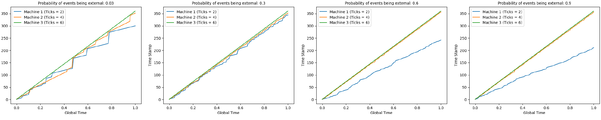
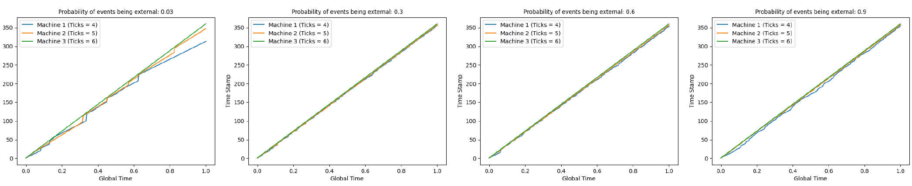
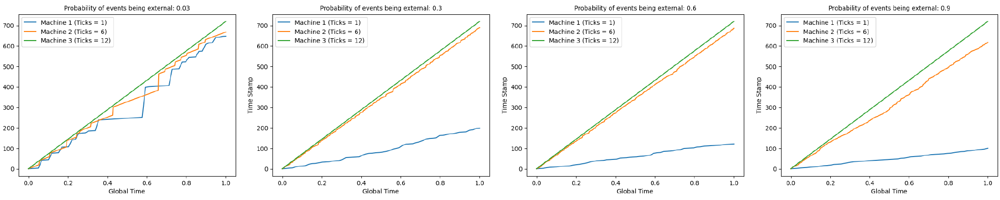

# CS262-Hw2-Clock
CS262 programming assignment 2.   
This assignment creates three virtual machines with different processing speed that can send message to each other. Our goal is to record and analyze how the logical clock will evolve for different combination of clock speeds.

### How to run the code:
You can run simply run the `test.py` to get the test results. Outputs are generated in the log files `1.log`, `2.log`, `3.log`. Each contain the log of activities for its corresponding virtual machine. There are 2 parameters that you can play with:   
`(ticks1, ticks2, ticks3)` - These parameters denote how many number of clock ticks per (real world) second for corresponding machines. This means that only that many instructions can be performed by the machine during that time.  
`send_prob` - This is a parameter taking range from 0 to 1 denote the probability of the instructions being external (i.e. sending message to other machines instead of internal event.)

Additionally, you can change the value of `plot_fig`, which is set as `False` by default, to generate figures for further analysis of the results.

### Implementation details:
We use the module `multiprocessing.Queue` to construct all three virtual machines. The mechanism is pretty simple, each machine has a inqueue (which can be think of as its own message inbox) and two outqueues (which are the inqueues of the other two machines). Sending a message corresponds to put the message to the selected outqueues, and receiving a message corresponds to take one message out from the queue. For full implementation see `logicmachine.py`.

## Notebook
In this notebook we are going to discuss how the logical clock for each machine will be affected by the parameters `(ticks1, ticks2, ticks3)` and `send_prob`.

#### How the logical clock change with `send_prob`?

#### How the logical clock change with  `(ticks1, ticks2, ticks3)`?
  
  
  
